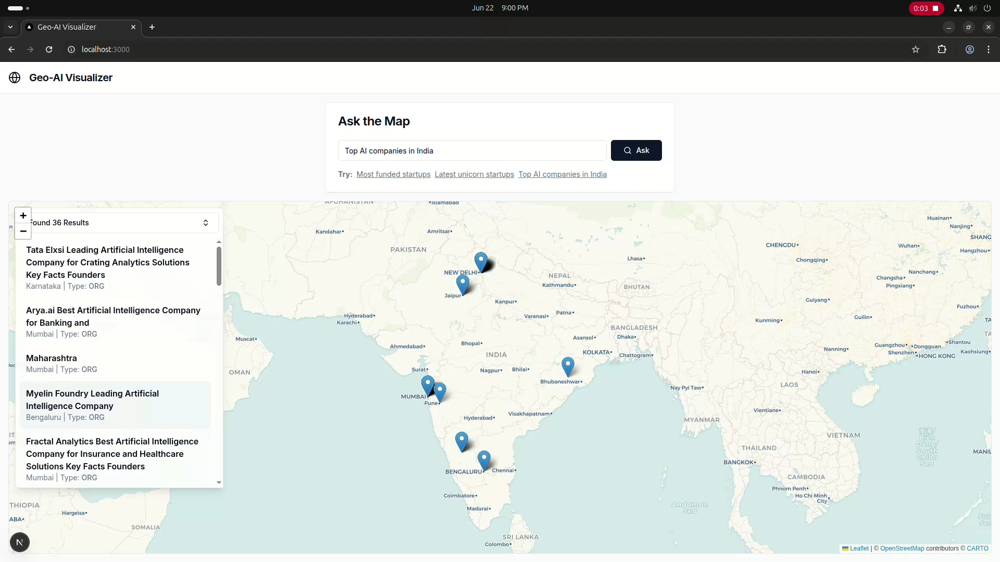

# 🌍 Geo-AI Visualizer: *Ask the Map*

  

**Geo-AI Visualizer** is an intelligent, interactive dashboard that allows users to ask complex, location-based questions in natural language and see the results visualized on a map.

Instead of using complex filters and forms, users can simply ask:

- “What are the top AI companies in the USA?”
- “Show me the most visited national parks in California.”
- “Where are biotech startups in Boston located?”
- “Show me startups in Mumbai.”

The application uses a blend of local AI models, web scraping, and external APIs to provide dynamic, up-to-date answers.

---

## ✨ Features

- **Natural Language Interface** – Ask questions just like you would to a person.
- **Dynamic Web Scraping** – For novel queries, the backend scrapes the web in real time.
- **Intelligent Entity Recognition** – Uses spaCy to understand entities like companies, facilities, and locations.
- **Context-Aware Filtering** – Filters results based on geographic context (e.g., “in India”).
- **Interactive Map** – Built with Leaflet.js, showing results as clickable points.
- **Collapsible Results Panel** – Clean UI for browsing and navigating results.
- **"Database First" Architecture** – Fast local vector search for common queries, with fallback to an LLM for complex ones.

---

## 🧠 Architecture Overview

**This is a full-stack application**, consisting of a FastAPI backend and a Next.js frontend.

### 🔙 Backend

- **Framework**: FastAPI  
- **AI / NLP Components**:
  - **Ollama + Phi-3 Mini**: For query analysis and optimization.
  - **SentenceTransformers + FAISS**: Fast local vector search on the startup dataset.
  - **spaCy**: Named Entity Recognition (NER) on scraped content.
- **Web Scraping**:
  - DuckDuckGo for searching articles.
  - BeautifulSoup4 for HTML parsing.
- **Geocoding**: `geopy` + Nominatim (OpenStreetMap) to convert names to coordinates.
- **Database**: SQLite for persistent local data storage.

### 🖥️ Frontend

- **Framework**: Next.js (React) with App Router
- **Styling**: Tailwind CSS + [shadcn/ui](https://ui.shadcn.com/)
- **Mapping**: Leaflet.js and React-Leaflet
- **State Management**: React Hooks (`useState`, `useMemo`, etc.)

---

## ⚙️ Prerequisites

Before running the app locally, make sure you have the following installed:

- [Python 3.9+](https://www.python.org/downloads/)
- [Node.js 18+](https://nodejs.org/en/download/)
- [Ollama](https://ollama.com/download) – for running local LLMs

---

## 🚀 Setup and Installation

### 1. Clone the Repository

```bash
git clone https://github.com/harshad208/geo-ai-visualizer.git
cd geo-ai-visualizer

```

### 2. Set Up External Dependencies

- Start Ollama & Download Phi-3 Mini

``` bash
ollama serve
```
- Pull the model (approx. 2.3GB, one-time setup):

``` bash
ollama pull phi3:mini
```

- To confirm installation:

```bash
ollama list
```

- Download the spaCy Model

```bash
python -m spacy download en_core_web_sm
```

### 3. Configure and Run the Backend

```bash
# Navigate to the backend directory
cd backend

# Create and activate a virtual environment
python -m venv venv
source venv/bin/activate  # Windows: venv\Scripts\activate

# Install dependencies
pip install -r requirements.txt

# (Optional - first time only) Build local database and FAISS index
python setup_ai.py

# Run the server
python run.py

```

- Your backend will now be running at: http://127.0.0.1:8000

### 4. Configure and Run the Frontend

```bash
# Open a NEW terminal and navigate to the frontend
cd frontend

# Install dependencies
npm install

# Optional: configure custom API URL
# Create .env.local and set:
# NEXT_PUBLIC_API_URL=http://localhost:8000

# Start the dev server
npm run dev

```

- Frontend will be live at: http://localhost:3000


# 🌐 Using the App

- Type any location-based query into the search bar and press Ask or hit Enter.

## 🔎 Example Queries

- “Top 10 most visited places in the USA”
- “Show me startups in Mumbai”
- “Famous museums in London”
- “Tech companies in Seattle”

### Results are either pulled from a local database or scraped live from the web, and displayed both on the map and in a collapsible results panel.


